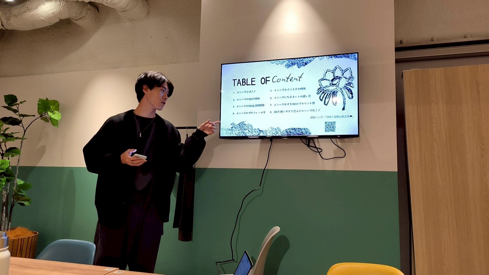
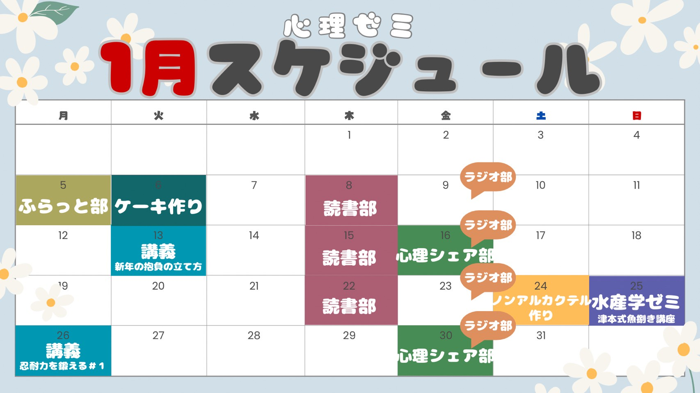

<!DOCTYPE html>
<html lang="ja">
<head>
    <meta charset="UTF-8">
    <meta name="viewport" content="width=device-width, initial-scale=1.0">
    <title>北大心理ゼミ - 学問の実践</title>
    <link rel="preconnect" href="https://fonts.googleapis.com">
    <link rel="preconnect" href="https://fonts.gstatic.com" crossorigin>
    <link href="https://fonts.googleapis.com/css2?family=Kaisei+Decol:wght@700&display=swap" rel="stylesheet">
    
</head>
<body>
    <!-- ==================== ヘッダー ==================== -->
    <header>
        

            

                
            

            Knowledge to Action
        

        <nav id="nav">
            <a href="#" onclick="showPage('home', event)">ホーム</a>
            <a href="#" onclick="showPage('activities', event)">活動内容</a>
            <a href="#" onclick="showPage('organization', event)">組織体制</a>
            <a href="#" onclick="showPage('join', event)">講義・イベント・PJ参加</a>
            <a href="#" onclick="showPage('contact', event)">お問い合わせ</a>
        </nav>
        

            
            
            
        

    </header>

    <!-- ==================== メインコンテンツ ==================== -->
    <main>
        <!-- ==================== トップページ ==================== -->
        

            <!-- ヒーローセクション -->
            <section class="hero">
                

                    <h1>心理ゼミ</h1>
                    
学問の実践 ～知識を行動に変え、未来を発掘する～

                

                

                    <svg viewBox="0 0 24 24" fill="none" stroke="currentColor">
                        <polyline points="18 15 12 21 6 15"></polyline>
                    </svg>
                

            </section>

            <!-- 活動セクション -->
            <section class="activities-section">
                <h2 class="section-title">主な活動</h2>
                

                    

                        

                            
                        

                        

                            <h3>心理ゼミ講義</h3>
                            
心理学の論文を基に、今すぐにでも使える心理テクニックを学ぶ講座です。理論と実践を組み合わせた学習経験をお提供します。

                            <a href="#" onclick="showPage('activities', event)" class="btn">詳しく見る</a>
                        

                    

                    

                        abc

                            
                        
abc
                        

                            <h3>部活動</h3>
                            
学問の実践の一歩手前で、誰もが気軽に小さな挑戦を始めることができる場です。多様な部活動からお選びいただけます。

                            <a href="#" onclick="showPage('activities', event)" class="btn">詳しく見る</a>
                        

                    

                    

                        

                            
                        

                        

                            <h3>プロジェクト</h3>
                            
心理学の知識に基づいたテクニックをメンバーで共有し、実践するためのプロジェクトです。実践的な学習機会を提供します。

                            <a href="#" onclick="showPage('activities', event)" class="btn">詳しく見る</a>
                        

                    

                

            </section>

            <!-- 魅力ポイント -->
            <section class="features">
                <h2 class="section-title">心理ゼミの魅力</h2>
                

                    

                        
📚

                        <h4>実践的な学び</h4>
                    

                    

                        
🎯

                        <h4>多様な活動</h4>
                    

                    

                        
⭐

                        <h4>自主性の尊重</h4>
                    

                    

                        
🤝

                        <h4>充実したサポート</h4>
                    

                    

                        
🌍

                        <h4>コミュニティ形成</h4>
                    

                

            </section>

            <!-- カレンダーセクション -->
            <section class="calendar-section">
                <h2 class="section-title">イベントカレンダー</h2>
                

                    

                        
                    

                    <a href="calendar1.jpg" download="calendar1.jpg" class="download-btn" style="display: inline-flex; align-items: center; gap: 8px; margin-top: 20px;">
                        <svg width="20" height="20" viewBox="0 0 24 24" fill="none" stroke="currentColor" stroke-width="2">
                            <path d="M21 15v4a2 2 0 0 1-2 2H5a2 2 0 0 1-2-2v-4"/>
                            <polyline points="7 10 12 15 17 10"/>
                            <line x1="12" y1="15" x2="12" y2="3"/>
                        </svg>
                        カレンダーをダウンロード
                    </a>
                

            </section>

            <!-- CTA セクション -->
            <section class="cta-section">
                <h2>心理ゼミに参加しませんか？</h2>
                
未来を一緒に発掘しましょう

                

                    <a href="https://twitter.com/tan2_rational" target="_blank" class="social-icon" title="X">𝕏</a>
                    <a href="https://instagram.com/tan1_is_rational" target="_blank" class="social-icon" title="Instagram">📷</a>
                

                <a href="#" onclick="showPage('join', event)" class="btn">講義・イベント・PJ参加を見る</a>
            </section>
        

        <!-- ==================== 活動詳細ページ ==================== -->
        

            

                <a href="#" onclick="showPage('home', event)">ホーム</a> > 活動内容
            

            

                <h1 class="section-title">主な活動</h1>

                <!-- 心理ゼミ講義 -->
                <h2 style="font-size: 36px; margin-top: 60px; margin-bottom: 30px;">心理ゼミ講義</h2>
                

                    
                

                
心理学の論文を基に今すぐにでも使える心理テクニックを学ぶ

                

                    <h3 style="margin-bottom: 20px;">講義の進め方</h3>
                    <ul style="list-style: none; color: var(--gray-medium);">
                        <li style="margin-bottom: 10px;">📖 毎週の論文紹介と解説</li>
                        <li style="margin-bottom: 10px;">🧠 心理学の基礎から応用まで</li>
                        <li style="margin-bottom: 10px;">💡 実践的なテクニックの習得</li>
                        <li>👥 グループディスカッション</li>
                    </ul>
                    <h3 style="margin-top: 30px; margin-bottom: 20px;">過去の講義テーマ例</h3>
                    <ul style="list-style: none; color: var(--gray-medium);">
                        <li>・認知バイアスと意思決定</li>
                        <li>・人間関係構築のテクニック</li>
                        <li>・動機づけの心理学</li>
                        <li>・ストレスマネジメント</li>
                    </ul>
                    <h3 style="margin-top: 30px; margin-bottom: 10px;">開催頻度</h3>
                    
毎週火曜日 19:00～

                

                <!-- 部活 -->
                <h2 style="font-size: 36px; margin-top: 60px; margin-bottom: 30px;">部活</h2>
                

                    
                

                
学問の実践の一歩手前で誰もが気軽に小さな挑戦を始めることができる場

                

                    

                        

                            
                        

                        

                            
読書部

                            
心理学関連書籍を読み、理解を深める部活動です。

                        

                    

                    

                        

                            
                        

                        

                            
心理シェア部

                            
日常の心理現象を共有し、学びを深めます。

                        

                    

                    

                        

                            
                        

                        

                            
すこやか部

                            
健康とウェルネスに関する活動を行います。

                        

                    

                    

                        

                            
                        

                        

                            
ラジオ部

                            
ラジオ番組の企画・制作・放送に携わります。

                        

                    

                    

                        

                            
                        

                        

                            
ふらっと部

                            
気軽に参加できるカジュアルな部活動です。

                        

                    

                    

                        

                            
                        

                        

                            
ノンアルカクテル部 ー旋ー

                            
カクテル文化を通じた交流の場です。

                        

                    

                

                <!-- プロジェクト -->
                <h2 style="font-size: 36px; margin-top: 60px; margin-bottom: 30px;">プロジェクト</h2>
                

                    
                

                
心理学の知識に基づいたテクニックをメンバーで共有し、実践するためのプロジェクト

                

                    

                        

                            
                        

                        

                            
実験再現プロジェクト

                            
心理学の著名な実験を再現・検証します。

                        

                    

                    

                        

                            
                        

                        

                            
運動プロジェクト

                            
身体活動と心理的効果の関連を探ります。

                        

                    

                    

                        

                            
                        

                        

                            
瞑想習慣化プロジェクト

                            
瞑想の習慣化と心理的変化を研究します。

                        

                    

                    

                        

                            
                        

                        

                            
快眠プロジェクト

                            
睡眠の質向上に向けた心理学的アプローチ。

                        

                    

                

            

        

        <!-- ==================== 組織紹介ページ ==================== -->
        

            

                <a href="#" onclick="showPage('home', event)">ホーム</a> > 組織体制
            

            

                <h1 class="section-title">組織体制</h1>

                <!-- 組織図 -->
                

                    <h3 style="margin-bottom: 30px;">北大心理ゼミの構成</h3>
                    

                        

                            

                                北大心理ゼミ
                            

                        

                        

                    

                    

                        

                            
心理ゼミ運営部

                            
心理ゼミ企画部

                            
基層メンバー

                        

                    

                

                <!-- 運営部 -->
                <h2 style="font-size: 36px; margin-top: 60px; margin-bottom: 30px;" class="role-section">心理ゼミ運営部</h2>
                

                    
                

                

                    <h3 style="margin-bottom: 20px;">何のためのチーム？</h3>
                    
北大心理ゼミの「理念」を達成する上で、様々な課題が存在します。これらの課題を解決し、心理ゼミの発展と持続を願うチームです。

                    <h3 style="margin-top: 30px; margin-bottom: 20px;">何をするチーム？</h3>
                    
以下の5つの役職から構成されます。

                

                

                    

                        

                            
                        

                        

                            
1

                            
代表

                            
運営部及び心理ゼミの長

                            
運営部及び心理ゼミの長であり、顔。心理ゼミ全体のマネジメントや団体の方向性の決定を司る。

                        

                    

                    

                        

                            
                        

                        

                            
2

                            
秘書

                            
「時間・行動」の課題を解決

                            
スケジュールやタスクを取りまとめ、活動全体のスピードをコントロール。

                        

                    

                    

                        

                            
                        

                        

                            
3

                            
統括

                            
「多様性・仲間」の課題を解決

                            
コミュニケーションを促進し、人と人の繋がりを作ります。

                        

                    

                    

                        

                            
                        

                        

                            
4

                            
広報

                            
「情報・表現」の課題を解決

                            
情報を取りまとめ、創造力を使ってツールや手順に工夫を凝らします。

                        

                    

                    

                        

                            
                        

                        

                            
5

                            
補佐

                            
「運営部」の課題を解決

                            
多角的な視点から、様々な問題や困難にサポートします。

                        

                    

                

                <!-- 企画部 -->
                <h2 style="font-size: 36px; margin-top: 60px; margin-bottom: 30px;">心理ゼミ企画部</h2>
                

                    
                

                
PJや部活を運営するアクティブなメンバーの集合体

                <!-- 基層メンバー -->
                <h2 style="font-size: 36px; margin-top: 60px; margin-bottom: 30px;">基層メンバー</h2>
                

                    
                

                

                    
心理ゼミにて開催されるPJやイベントへの参加者

                    
部員数（随時更新）

                    
北海道大学の学生が中心に活動しています

                

            

        

        <!-- ==================== 講義・イベント・PJ参加ページ ==================== -->
        

            

                <a href="#" onclick="showPage('home', event)">ホーム</a> > 講義・イベント・PJ参加
            

            

                <h1 class="section-title">講義・イベント・PJ参加</h1>

                

                    ヘッダー画像を挿入
                

                

                    

                        

                            
初心者歓迎

                            
常に活動内容は変化し続けているのでむしろほとんどが初心者です。

                        

                    

                    

                        

                            
理念への共感

                            
心理学への興味や「学問の実践」という理念に共感できる方もお待ちしています。

                        

                    

                    

                        

                            
経験不問

                            
特別な経験やスキルは不要です。あっても邪魔なだけです。

                        

                    

                

                <!-- イベント情報 -->
                <h2 style="font-size: 36px; margin-top: 60px; margin-bottom: 30px;">定期イベント</h2>
                
                

                    <h3 style="margin-bottom: 20px;">心理学講義</h3>
                    
定期的に開催される心理学の講座です。初心者から上級者まで参加できます。

                    
                    <h3 style="margin-top: 30px; margin-bottom: 20px;">部活動</h3>
                    
各部活ごとに定期開催されています。興味のある部活に自由に参加できます。

                

                <!-- 新歓イベント -->
                <h3 style="font-size: 24px; margin-bottom: 20px;">新歓期イベント</h3>
                

                    

                        オンライン新歓
                        ＋
                    

                    

                        
オンラインで心理ゼミについて知ることができるイベントです。気軽にご参加ください。

                    

                

                

                    

                        履修相談会
                        ＋
                    

                    

                        
心理学や関連科目の履修についてのアドバイスを受けられます。

                    

                

                

                    

                        新歓パーティ
                        ＋
                    

                    

                        
既存メンバーと新入生が交流できるカジュアルなイベントです。

                    

                

                

                    

                        長橋合宿
                        ＋
                    

                    

                        
年に一度の合宿で、深い交流と学びの時間を共有します。

                    

                

                <!-- FAQ -->
                <h2 style="font-size: 36px; margin-top: 60px; margin-bottom: 30px;">よくある質問</h2>
                
                

                    

                        心理学の知識がなくても参加できますか？
                        ＋
                    

                    

                        
はい、どなたでも参加できます。開催されるイベントは心理学に関わるものに留まりません。初心者向けの講座も多数用意しています。

                    

                

                

                    

                        活動頻度はどのくらいですか？
                        ＋
                    

                    

                        
定例会、講義、各部活動があり、参加したい活動を選択できます。無理のないペースでご参加ください。

                    

                

                

                    

                        費用はかかりますか？
                        ＋
                    

                    

                        
参加するイベントによります。基本的な活動は無料ですが、合宿や特別イベントについては別途費用が発生する場合があります。

                    

                

                

                    

                        北大生以外でも参加できますか？
                        ＋
                    

                    

                        
基本的には北大生を対象としていますが、ご質問があればお気軽にお問い合わせください。

                    

                

                <!-- 次のステップ -->
                

                    <h3 style="font-size: 28px; margin-bottom: 30px;">質問やご不明な点はお気軽にお尋ねください</h3>
                    <a href="#" onclick="showPage('contact', event)" class="btn" style="padding: 15px 40px; font-size: 16px;">お問い合わせ</a>
                

                

                    <h4 style="margin-bottom: 20px;">SNSフォロー</h4>
                    

                        <a href="https://twitter.com/tan2_rational" target="_blank" class="social-icon" title="X">𝕏</a>
                        <a href="https://instagram.com/tan1_is_rational" target="_blank" class="social-icon" title="Instagram">📷</a>
                    

                

            

        

        <!-- ==================== お問い合わせページ ==================== -->
        

            

                <a href="#" onclick="showPage('home', event)">ホーム</a> > お問い合わせ
            

            

                <h1 class="section-title">お問い合わせ</h1>

                <!-- フォーム -->
                <form id="contactForm" style="background: var(--text-light); padding: 40px; border-radius: 12px;">
                    

                        <label for="email" class="required">メールアドレス</label>
                        <input type="email" id="email" name="email" placeholder="your-email@example.com" required>
                        

                    

                    

                        <label for="affiliation" class="required">所属</label>
                        <select id="affiliation" name="affiliation" required>
                            <option value="">選択してください</option>
                            <option value="hokudai-student">北海道大学学生</option>
                            <option value="other-student">他大学学生</option>
                            <option value="highschool">高校生</option>
                            <option value="company">企業</option>
                            <option value="other">その他</option>
                        </select>
                        

                    

                    

                        <label for="message" class="required">お問い合わせ内容</label>
                        <textarea id="message" name="message" placeholder="お問い合わせ内容をご記入ください" maxlength="1000" required></textarea>
                        
0/1000

                        

                    

                    <button type="submit" class="btn" style="width: 100%; padding: 15px; font-size: 16px;">送信する</button>
                </form>

                <!-- その他の連絡方法 -->
                

                    <h2 style="font-size: 28px; margin-bottom: 30px;">その他の連絡方法</h2>
                    

                        <a href="https://twitter.com/tan2_rational" target="_blank" style="display: flex; align-items: center; gap: 15px; padding: 20px; background: var(--text-light); border-radius: 12px; text-decoration: none; color: var(--text-dark); transition: all 0.3s ease;" onmouseover="this.style.background='var(--primary-light)'" onmouseout="this.style.background='var(--text-light)'">
                            
𝕏

                            

                                
X (Twitter)

                                
@tan2_rational

                            

                        </a>
                        <a href="https://instagram.com/tan1_is_rational" target="_blank" style="display: flex; align-items: center; gap: 15px; padding: 20px; background: var(--text-light); border-radius: 12px; text-decoration: none; color: var(--text-dark); transition: all 0.3s ease;" onmouseover="this.style.background='var(--primary-light)'" onmouseout="this.style.background='var(--text-light)'">
                            
📷

                            

                                
Instagram

                                
@tan1_is_rational

                            

                        </a>
                    

                

            

        

    </main>

    <!-- ==================== フッター ==================== -->
    <footer>
        

            

                <h4>心理ゼミについて</h4>
                
北海道大学心理ゼミは、学問の実践を通じて、学生の成長と未来の発掘をサポートします。

            

            

                <h4>ナビゲーション</h4>
                <ul>
                    <li><a href="#" onclick="showPage('home', event)">ホーム</a></li>
                    <li><a href="#" onclick="showPage('activities', event)">活動内容</a></li>
                    <li><a href="#" onclick="showPage('organization', event)">組織体制</a></li>
                    <li><a href="#" onclick="showPage('join', event)">講義・イベント・PJ参加</a></li>
                    <li><a href="#" onclick="showPage('contact', event)">お問い合わせ</a></li>
                </ul>
            

            

                <h4>SNS</h4>
                <ul>
                    <li><a href="https://twitter.com/tan2_rational" target="_blank">X (Twitter)</a></li>
                    <li><a href="https://instagram.com/tan1_is_rational" target="_blank">Instagram</a></li>
                </ul>
            

        

        

            
&copy; 2026 北大心理ゼミ All rights reserved.

        

    </footer>

    <!-- ==================== モーダル ==================== -->
    

        

            
✅

            
送信完了

            
お問い合わせをお送りいただきありがとうございます。 確認後、ご連絡させていただきます。

            <button class="btn" onclick="closeModal()">閉じる</button>
        

    

    
</body>
</html>
